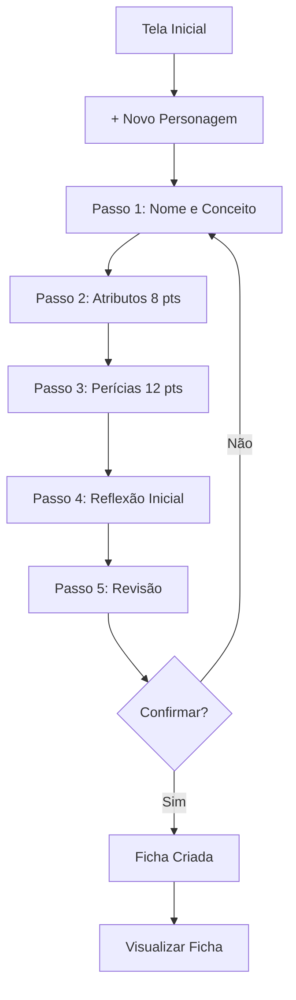
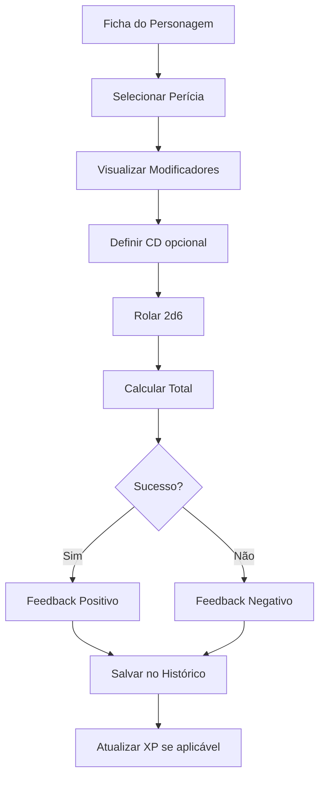
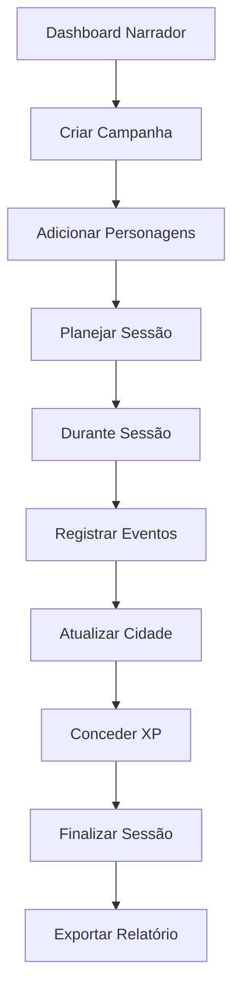

# Plano de Design (UI/UX) - Detetive Existencial Companion App

**Data:** 26 de Dezembro de 2025  
**Versão:** 1.0  
**Objetivo:** Definir identidade visual, experiência do usuário e padrões de interface

---

## 1. FILOSOFIA DE DESIGN

### 1.1. Princípios Fundamentais

#### 1. Noir Existencial
- **Paleta Escura:** Tons de cinza, preto, com acentos de amarelo/âmbar (inspirado em Disco Elysium)
- **Tipografia:** Fontes serifadas para títulos (atmosfera literária), sans-serif para corpo
- **Atmosfera:** Melancólica, introspectiva, urbana degradada

#### 2. Funcionalidade Sobre Forma
- **Clareza:** Informação sempre visível e acessível
- **Hierarquia:** Elementos importantes em destaque
- **Feedback:** Interações com resposta visual imediata

#### 3. Mobile-First, Desktop-Enhanced
- **Prioridade Mobile:** Design pensado primeiro para telas pequenas
- **Expansão Desktop:** Aproveitar espaço extra sem poluir
- **Touch-Friendly:** Botões grandes (min 44x44px), gestos intuitivos

#### 4. Acessibilidade Universal
- **WCAG 2.1 AA:** Contraste mínimo 4.5:1, navegação por teclado
- **Screen Readers:** Semântica HTML correta, ARIA labels
- **Sem Dependência de Cor:** Informação não apenas por cor

---

## 2. IDENTIDADE VISUAL

### 2.1. Paleta de Cores

#### Cores Primárias
```css
/* Background */
--bg-primary: #0a0a0a;      /* Preto profundo */
--bg-secondary: #1a1a1a;    /* Cinza escuro */
--bg-tertiary: #2a2a2a;     /* Cinza médio */

/* Foreground */
--fg-primary: #e8e8e8;      /* Branco sujo */
--fg-secondary: #b8b8b8;    /* Cinza claro */
--fg-tertiary: #888888;     /* Cinza médio */

/* Accent */
--accent-primary: #d4af37;  /* Dourado/Âmbar */
--accent-secondary: #8b7355; /* Bronze */
--accent-danger: #c44536;   /* Vermelho queimado */
--accent-success: #5a7d5a;  /* Verde musgo */
```

#### Cores Semânticas
```css
/* Atributos */
--intellect: #4a90e2;       /* Azul frio */
--psyche: #9b59b6;          /* Roxo */
--physique: #e74c3c;        /* Vermelho */
--motorics: #f39c12;        /* Laranja */

/* Estados */
--morale: #9b59b6;          /* Roxo (Psique) */
--health: #e74c3c;          /* Vermelho (Físico) */
--xp: #d4af37;              /* Dourado */
--money: #5a7d5a;           /* Verde */
```

### 2.2. Tipografia

#### Fontes
```css
/* Títulos e Headers */
--font-display: 'Playfair Display', serif;
--font-heading: 'Merriweather', serif;

/* Corpo e UI */
--font-body: 'Inter', sans-serif;
--font-mono: 'JetBrains Mono', monospace;

/* Tamanhos */
--text-xs: 0.75rem;    /* 12px */
--text-sm: 0.875rem;   /* 14px */
--text-base: 1rem;     /* 16px */
--text-lg: 1.125rem;   /* 18px */
--text-xl: 1.25rem;    /* 20px */
--text-2xl: 1.5rem;    /* 24px */
--text-3xl: 1.875rem;  /* 30px */
--text-4xl: 2.25rem;   /* 36px */
```

#### Hierarquia Tipográfica
- **H1:** Display, 36px, bold, accent color
- **H2:** Heading, 24px, semibold, primary color
- **H3:** Heading, 20px, semibold, primary color
- **Body:** Body, 16px, regular, secondary color
- **Caption:** Body, 14px, regular, tertiary color
- **Label:** Body, 12px, uppercase, tertiary color

### 2.3. Espaçamento e Grid

#### Sistema de Espaçamento (8px base)
```css
--space-1: 0.25rem;  /* 4px */
--space-2: 0.5rem;   /* 8px */
--space-3: 0.75rem;  /* 12px */
--space-4: 1rem;     /* 16px */
--space-6: 1.5rem;   /* 24px */
--space-8: 2rem;     /* 32px */
--space-12: 3rem;    /* 48px */
--space-16: 4rem;    /* 64px */
```

#### Breakpoints
```css
--mobile: 320px;     /* Mínimo suportado */
--tablet: 768px;     /* iPad */
--desktop: 1024px;   /* Laptop */
--wide: 1440px;      /* Desktop grande */
```

### 2.4. Componentes Visuais

#### Bordas e Sombras
```css
/* Bordas */
--border-radius-sm: 4px;
--border-radius-md: 8px;
--border-radius-lg: 12px;
--border-width: 1px;

/* Sombras */
--shadow-sm: 0 1px 2px rgba(0, 0, 0, 0.5);
--shadow-md: 0 4px 6px rgba(0, 0, 0, 0.6);
--shadow-lg: 0 10px 15px rgba(0, 0, 0, 0.7);
--shadow-xl: 0 20px 25px rgba(0, 0, 0, 0.8);

/* Glow (para acentos) */
--glow-accent: 0 0 10px rgba(212, 175, 55, 0.5);
```

#### Animações
```css
/* Transições */
--transition-fast: 150ms ease-in-out;
--transition-base: 250ms ease-in-out;
--transition-slow: 350ms ease-in-out;

/* Easing */
--ease-in-out: cubic-bezier(0.4, 0, 0.2, 1);
--ease-out: cubic-bezier(0, 0, 0.2, 1);
--ease-in: cubic-bezier(0.4, 0, 1, 1);
```

---

## 3. DESIGN SYSTEM - COMPONENTES

### 3.1. Componentes Base (Atoms)

#### Button
```tsx
// Variantes
<Button variant="primary">Criar Personagem</Button>
<Button variant="secondary">Cancelar</Button>
<Button variant="danger">Deletar</Button>
<Button variant="ghost">Detalhes</Button>

// Tamanhos
<Button size="sm">Pequeno</Button>
<Button size="md">Médio</Button>
<Button size="lg">Grande</Button>

// Estados
<Button disabled>Desabilitado</Button>
<Button loading>Carregando...</Button>
```

**Especificações:**
- **Primary:** Background accent-primary, texto preto, hover glow
- **Secondary:** Border accent-primary, texto accent-primary, hover fill
- **Danger:** Background accent-danger, texto branco
- **Ghost:** Transparente, texto secondary, hover bg-tertiary
- **Min Height:** 44px (touch-friendly)
- **Padding:** 12px 24px (md), 8px 16px (sm), 16px 32px (lg)

#### Input
```tsx
<Input 
  label="Nome do Personagem"
  placeholder="Digite o nome..."
  error="Nome é obrigatório"
  helperText="Escolha um nome memorável"
/>
```

**Especificações:**
- **Background:** bg-secondary
- **Border:** 1px solid tertiary, focus accent-primary
- **Height:** 48px (touch-friendly)
- **Padding:** 12px 16px
- **Label:** text-sm, fg-secondary, acima do input
- **Error:** text-sm, accent-danger, abaixo do input

#### Card
```tsx
<Card variant="default">
  <CardHeader>Título</CardHeader>
  <CardContent>Conteúdo</CardContent>
  <CardFooter>Ações</CardFooter>
</Card>
```

**Especificações:**
- **Background:** bg-secondary
- **Border:** 1px solid bg-tertiary
- **Border Radius:** 8px
- **Padding:** 16px (mobile), 24px (desktop)
- **Shadow:** shadow-md, hover shadow-lg

#### Badge
```tsx
<Badge variant="intellect">INT 4</Badge>
<Badge variant="psyche">PSY 2</Badge>
<Badge variant="success">Nível 5</Badge>
```

**Especificações:**
- **Padding:** 4px 8px
- **Border Radius:** 4px
- **Font Size:** 12px, uppercase, bold
- **Colors:** Usar cores semânticas dos atributos

#### LanguageSwitcher
```tsx
<LanguageSwitcher />
```

**Layout:**
```
┌─────────────────┐
│ 🇧🇷 Português ▼ │
└─────────────────┘

[Dropdown aberto]
┌─────────────────┐
│ 🇧🇷 Português ✓ │
│ 🇺🇸 English     │
│ 🇪🇸 Español     │
│ 🇫🇷 Français    │
│ 🇩🇪 Deutsch     │
└─────────────────┘
```

**Especificações:**
- **Posição:** Header (canto superior direito)
- **Detecção Automática:** Via Accept-Language
- **Persistência:** Cookie NEXT_LOCALE
- **Idiomas Tier 1:** pt-BR (base), en (nativo)
- **Idiomas Tier 2:** es, fr, de (AI-translated)

### 3.2. Componentes Compostos (Molecules)

#### AttributeDisplay
```tsx
<AttributeDisplay
  name="Intelecto"
  value={4}
  color="intellect"
  skills={[
    { name: 'Lógica', value: 5 },
    { name: 'Enciclopédia', value: 4 }
  ]}
/>
```

**Layout:**
```
┌─────────────────────────┐
│ INTELECTO           [4] │ ← Header com badge
├─────────────────────────┤
│ Lógica              [5] │ ← Skill row
│ Enciclopédia        [4] │
│ Retórica            [4] │
│ ...                     │
└─────────────────────────┘
```

#### DiceRoller (Sistema Padrão)
```tsx
<DiceRoller
  skillName="Percepção"
  skillLevel={4}
  attributeLevel={2}
  difficulty={12}
  onRoll={(result) => console.log(result)}
/>
```

**Layout:**
```
┌─────────────────────────┐
│ Percepção               │
│ 2d6 + 4 (skill) + 2 (MOT)│
│                         │
│   [Rolar Dados]         │ ← Button
│                         │
│ Resultado: 14 ✓         │ ← Após rolagem
│ (Rolou: 5, 3)           │
└─────────────────────────┘
```

#### GenericDiceRoller (Notação xdY)
```tsx
<GenericDiceRoller
  onRoll={(result) => console.log(result)}
/>
```

**Layout:**
```
┌─────────────────────────┐
│ Rolagem Genérica        │
│                         │
│ [1d20____] [Rolar]      │ ← Input + Button
│                         │
│ Exemplos: 1d20, 2d6,    │
│ 3d8, 4d10+5, 2d12-3     │
│                         │
│ Resultado: 15           │ ← Após rolagem
│ (Rolou: [15])           │
│                         │
│ Histórico:              │
│ • 2d6: 8 ([3, 5])       │
│ • 1d20+5: 18 ([13]+5)   │
└─────────────────────────┘
```

**Funcionalidades:**
- Parse de notação: `1d20`, `2d6`, `3d8+5`, `4d10-3`
- Validação de entrada
- Histórico de rolagens genéricas
- Suporte a modificadores (+X, -X)

#### ResourceBar
```tsx
<ResourceBar
  label="Moral"
  current={3}
  max={5}
  color="morale"
  icon={<HeartIcon />}
/>
```

**Layout:**
```
┌─────────────────────────┐
│ ❤️ Moral          [3/5] │
│ ████████░░░░░░░░░░░░░░░ │ ← Progress bar
└─────────────────────────┘
```

### 3.3. Componentes Complexos (Organisms)

#### CharacterSheet
**Layout Desktop:**
```
┌────────────────────────────────────────┐
│ [Nome]                    [XP: 120]    │
├──────────────┬─────────────────────────┤
│ ATRIBUTOS    │ RECURSOS                │
│ INT [4] ████ │ Moral    [3/5] ████░    │
│ PSY [2] ██   │ Saúde    [4/6] ██████░  │
│ FYS [2] ██   │ Dinheiro R$ 45          │
│ MOT [2] ██   │ XP       120            │
├──────────────┴─────────────────────────┤
│ PERÍCIAS                               │
│ [Intelecto ▼]                          │
│ Lógica              [5] [Rolar]        │
│ Enciclopédia        [4] [Rolar]        │
│ ...                                    │
├────────────────────────────────────────┤
│ GABINETE DE REFLEXÕES                  │
│ [Slot 1] Advogado de Si Mesmo ✓        │
│ [Slot 2] Processando... (1 sessão)     │
│ [Slot 3] Vazio                         │
└────────────────────────────────────────┘
```

**Layout Mobile:**
```
┌──────────────────┐
│ [Nome]           │
│ XP: 120          │
├──────────────────┤
│ [Recursos ▼]     │ ← Accordion
│ Moral    [3/5]   │
│ Saúde    [4/6]   │
├──────────────────┤
│ [Atributos ▼]    │
│ INT [4] PSY [2]  │
│ FYS [2] MOT [2]  │
├──────────────────┤
│ [Perícias ▼]     │
│ Lógica      [5]  │
│ [Rolar]          │
├──────────────────┤
│ [Reflexões ▼]    │
│ Slot 1: Adv...   │
└──────────────────┘
```

#### ThoughtCabinet
```
┌────────────────────────────────────────┐
│ GABINETE DE REFLEXÕES          [3/12]  │
├────────────────────────────────────────┤
│ ┌────────────────────────────────────┐ │
│ │ 🧠 Advogado de Si Mesmo            │ │
│ │ Nível 1 • Internalizado            │ │
│ │                                    │ │
│ │ Solução: +1 Retórica, limite +1    │ │
│ │ [Detalhes] [Remover]               │ │
│ └────────────────────────────────────┘ │
│                                        │
│ ┌────────────────────────────────────┐ │
│ │ ⏳ Coxinha do Bar                   │ │
│ │ Nível 2 • Processando (1 sessão)   │ │
│ │                                    │ │
│ │ Problema: -2 Empatia               │ │
│ │ [Acelerar] [Abandonar]             │ │
│ └────────────────────────────────────┘ │
│                                        │
│ [+ Adicionar Reflexão]                 │
└────────────────────────────────────────┘
```

#### CampaignManager (Modo Narrador)
```
┌────────────────────────────────────────┐
│ 🎭 MODO NARRADOR                       │
│ Campanha: Mistério de Revachol        │
│ [Modo Jogador] [Editar] [Exportar]     │
├────────────────────────────────────────┤
│ PERSONAGENS VINCULADOS (3)             │
│ ☑ João Silva (Detetive Clássico)       │
│ ☑ Maria Santos (Trem-Bala Emocional)   │
│ ☐ Pedro Costa (Inativo)                │
│ [+ Vincular Personagem Existente]      │
├────────────────────────────────────────┤
│ SESSÃO ATUAL (#12) - 20/12/2025        │
│ Resumo Público: "Confronto no cais"    │
│ [Editar]                               │
│                                        │
│ 📝 ANOTAÇÕES PRIVADAS (5)              │
│ • "Suspeito esconde arma no..." 🔒     │
│   [👁 Revelar]                         │
│ • "Pista: sangue tipo O+" ✓ Revelado  │
│ [Revelar Todas] [Nova Anotação]        │
├────────────────────────────────────────┤
│ EVENTOS DA SESSÃO                      │
│ 14:32 - Rolagem: Percepção (João) 🔒   │
│         Resultado: 15 (Sucesso)        │
│         [👁 Revelar Resultado]         │
│ 14:45 - Combate iniciado ✓ Revelado   │
├────────────────────────────────────────┤
│ SAÚDE DA CIDADE                        │
│ Moral  [6/10] ████████░░               │
│ Saúde  [4/10] ████░░░░░░               │
├────────────────────────────────────────┤
│ [Nova Sessão] [Gerenciar NPCs]         │
└────────────────────────────────────────┘
```

#### CampaignView (Modo Jogador)
```
┌────────────────────────────────────────┐
│ 👤 MODO JOGADOR: João Silva            │
│ Campanha: Mistério de Revachol        │
│ [Meu Personagem] [Sessões]             │
├────────────────────────────────────────┤
│ SESSÃO ATUAL (#12) - 20/12/2025        │
│ "Confronto no cais"                    │
│                                        │
│ EVENTOS REVELADOS                      │
│ 14:45 - Combate iniciado               │
│ 14:50 - Pista descoberta: sangue O+    │
│                                        │
│ (Anotações privadas do narrador        │
│  aparecerão aqui quando reveladas)     │
├────────────────────────────────────────┤
│ MEUS PERSONAGENS NESTA CAMPANHA        │
│ • João Silva (Ativo)                   │
│   [Ver Ficha]                          │
└────────────────────────────────────────┘
```

#### RandomCharacterGenerator
```
┌────────────────────────────────────────┐
│ Gerador de Personagens Aleatórios     │
├────────────────────────────────────────┤
│ Arquétipo: [🎲 Aleatório      ▼]      │
│ Gênero:    [🎲 Aleatório      ▼]      │
│                                        │
│ [🎲 Gerar Personagem]                  │
│                                        │
├────────────────────────────────────────┤
│ PREVIEW                                │
│                                        │
│ Nome: João Silva                       │
│                                        │
│ Atributos:                             │
│ • INT: 4  • PSY: 2                     │
│ • FYS: 2  • MOT: 2                     │
│                                        │
│ Recursos:                              │
│ • Moral: 4  • Saúde: 3                 │
│                                        │
│ Reflexão Inicial:                      │
│ • Advogado de Si Mesmo                 │
│                                        │
│ [✓ Salvar Personagem] [🔄 Gerar Outro] │
└────────────────────────────────────────┘
```

---

## 4. FLUXOS DE USUÁRIO

### 4.1. Criação de Personagem (Jogador)



**Wireframe - Passo 2: Atributos**
```
┌────────────────────────────────────────┐
│ Criação de Personagem           [2/5]  │
│ ████████░░░░░░░░░░░░░░░░░░░░░░░░░░     │
├────────────────────────────────────────┤
│ Distribua 8 pontos entre os atributos  │
│ (Mínimo 1, Máximo 5 cada)              │
│                                        │
│ Pontos Restantes: [4]                  │
│                                        │
│ ┌────────────────────────────────────┐ │
│ │ INTELECTO                     [2]  │ │
│ │ [−] ██░░░░░░░░ [+]                 │ │
│ │ Lógica, conhecimento, argumentação │ │
│ └────────────────────────────────────┘ │
│                                        │
│ ┌────────────────────────────────────┐ │
│ │ PSIQUE                        [2]  │ │
│ │ [−] ██░░░░░░░░ [+]                 │ │
│ │ Emoção, força de vontade, intuição │ │
│ └────────────────────────────────────┘ │
│                                        │
│ [Voltar]              [Próximo Passo]  │
└────────────────────────────────────────┘
```

### 4.2. Rolagem de Dados (Durante Jogo)



**Wireframe - Rolagem**
```
┌────────────────────────────────────────┐
│ Rolar: Percepção                       │
├────────────────────────────────────────┤
│ Modificadores:                         │
│ • Percepção: +4                        │
│ • Motricidade: +2                      │
│ • Total: +6                            │
│                                        │
│ Dificuldade (CD): [12] (Desafiador)    │
│                                        │
│ ┌────────────────────────────────────┐ │
│ │                                    │ │
│ │        [Rolar 2d6]                 │ │
│ │                                    │ │
│ └────────────────────────────────────┘ │
│                                        │
│ Resultado: 2d6 (4, 5) + 6 = 15 ✓       │
│ SUCESSO! (CD 12)                       │
│                                        │
│ [Rolar Novamente] [Fechar]             │
└────────────────────────────────────────┘
```

### 4.3. Gerenciamento de Campanha (Narrador)



---

## 5. RESPONSIVIDADE

### 5.1. Estratégias por Breakpoint

#### Mobile (320px - 767px)
- **Layout:** Single column, accordions para seções
- **Navegação:** Bottom tab bar (Home, Personagens, Campanhas, Ferramentas)
- **Interações:** Touch gestures (swipe, long press)
- **Densidade:** Espaçamento generoso (min 44px touch targets)

#### Tablet (768px - 1023px)
- **Layout:** Two columns onde apropriado
- **Navegação:** Side drawer + top bar
- **Interações:** Híbrido (touch + mouse)
- **Densidade:** Moderada

#### Desktop (1024px+)
- **Layout:** Multi-column, sidebars permanentes
- **Navegação:** Sidebar fixa + breadcrumbs
- **Interações:** Mouse + keyboard shortcuts
- **Densidade:** Compacta, mais informação visível

### 5.2. Componentes Adaptativos

#### Navegação
```tsx
// Mobile: Bottom Tab Bar
<nav className="fixed bottom-0 flex justify-around">
  <NavItem icon={<HomeIcon />} label="Início" />
  <NavItem icon={<UserIcon />} label="Personagens" />
  <NavItem icon={<BookIcon />} label="Campanhas" />
</nav>

// Desktop: Sidebar
<aside className="fixed left-0 h-full w-64">
  <NavItem icon={<HomeIcon />} label="Início" />
  <NavItem icon={<UserIcon />} label="Personagens" />
  <NavItem icon={<BookIcon />} label="Campanhas" />
</aside>
```

#### Ficha de Personagem
```tsx
// Mobile: Accordions
<Accordion>
  <AccordionItem title="Atributos">...</AccordionItem>
  <AccordionItem title="Perícias">...</AccordionItem>
  <AccordionItem title="Reflexões">...</AccordionItem>
</Accordion>

// Desktop: Grid Layout
<div className="grid grid-cols-3 gap-6">
  <div>Atributos</div>
  <div>Perícias</div>
  <div>Reflexões</div>
</div>
```

---

## 6. ACESSIBILIDADE

### 6.1. Checklist WCAG 2.1 AA

#### Perceptível
- ✅ Contraste mínimo 4.5:1 (texto normal)
- ✅ Contraste mínimo 3:1 (texto grande)
- ✅ Texto redimensionável até 200%
- ✅ Sem informação apenas por cor
- ✅ Legendas para vídeos (se aplicável)

#### Operável
- ✅ Navegação completa por teclado
- ✅ Sem armadilhas de teclado
- ✅ Tempo suficiente para interações
- ✅ Sem conteúdo piscante (epilepsia)
- ✅ Skip links para conteúdo principal

#### Compreensível
- ✅ Linguagem clara e simples
- ✅ Navegação consistente
- ✅ Identificação de erros clara
- ✅ Sugestões de correção
- ✅ Prevenção de erros (confirmações)

#### Robusto
- ✅ HTML semântico válido
- ✅ ARIA labels onde necessário
- ✅ Compatibilidade com screen readers
- ✅ Suporte a tecnologias assistivas

### 6.2. Implementação Técnica

#### Semântica HTML
```tsx
<main>
  <h1>Detetive Existencial Companion</h1>
  <nav aria-label="Navegação principal">
    <ul>
      <li><a href="/characters">Personagens</a></li>
    </ul>
  </nav>
  <section aria-labelledby="characters-heading">
    <h2 id="characters-heading">Meus Personagens</h2>
    {/* Conteúdo */}
  </section>
</main>
```

#### ARIA Labels
```tsx
<button 
  aria-label="Rolar dados para Percepção"
  aria-describedby="roll-description"
>
  Rolar
</button>
<div id="roll-description" className="sr-only">
  Rola 2d6 + 4 (Percepção) + 2 (Motricidade)
</div>
```

#### Navegação por Teclado
```tsx
// Atalhos globais
useEffect(() => {
  const handleKeyPress = (e: KeyboardEvent) => {
    if (e.ctrlKey && e.key === 'n') {
      e.preventDefault();
      createNewCharacter();
    }
  };
  window.addEventListener('keydown', handleKeyPress);
  return () => window.removeEventListener('keydown', handleKeyPress);
}, []);
```

---

## 7. ANIMAÇÕES E MICRO-INTERAÇÕES

### 7.1. Princípios de Animação

1. **Sutileza:** Animações devem ser percebidas, não distrair
2. **Performance:** 60fps, usar transform/opacity (GPU-accelerated)
3. **Propósito:** Cada animação tem função (feedback, transição, atenção)
4. **Respeito:** Respeitar `prefers-reduced-motion`

### 7.2. Animações Específicas

#### Rolagem de Dados
```tsx
// Animação de "shake" ao rolar
@keyframes diceRoll {
  0%, 100% { transform: rotate(0deg); }
  25% { transform: rotate(-15deg); }
  75% { transform: rotate(15deg); }
}

.dice-rolling {
  animation: diceRoll 0.5s ease-in-out;
}
```

#### Ganho de XP
```tsx
// Número flutuando e desaparecendo
@keyframes xpGain {
  0% {
    opacity: 0;
    transform: translateY(0);
  }
  50% {
    opacity: 1;
  }
  100% {
    opacity: 0;
    transform: translateY(-30px);
  }
}

.xp-notification {
  animation: xpGain 2s ease-out;
}
```

#### Hover em Cards
```tsx
.card {
  transition: transform 250ms ease-out, box-shadow 250ms ease-out;
}

.card:hover {
  transform: translateY(-4px);
  box-shadow: var(--shadow-lg);
}
```

---

## 8. ESTADOS E FEEDBACK

### 8.1. Estados de Componentes

#### Loading
```tsx
<Button loading>
  <Spinner /> Salvando...
</Button>
```

#### Success
```tsx
<Toast variant="success">
  ✓ Personagem salvo com sucesso!
</Toast>
```

#### Error
```tsx
<Toast variant="error">
  ✗ Erro ao salvar. Tente novamente.
</Toast>
```

#### Empty State
```tsx
<EmptyState
  icon={<UserIcon />}
  title="Nenhum personagem criado"
  description="Crie seu primeiro personagem para começar"
  action={<Button>Criar Personagem</Button>}
/>
```

### 8.2. Feedback Visual

| Ação | Feedback |
|------|----------|
| **Salvar dados** | Toast "Salvo", ícone de check |
| **Erro de validação** | Campo vermelho, mensagem de erro |
| **Rolagem de dados** | Animação de shake, resultado destacado |
| **Ganho de XP** | Número flutuante, barra de progresso |
| **Reflexão internalizada** | Confete, som de "ding" (opcional) |
| **Dano em Moral/Saúde** | Barra pisca vermelho, shake |

---

## 9. PROTÓTIPOS E MOCKUPS

### 9.1. Ferramentas Recomendadas
- **Figma:** Design de alta fidelidade, protótipos interativos
- **Excalidraw:** Wireframes rápidos, fluxos de usuário
- **Coolors:** Geração de paletas de cores

### 9.2. Entregáveis de Design
1. **Wireframes Low-Fidelity:** Estrutura básica de todas as telas
2. **Mockups High-Fidelity:** Design final com cores, tipografia, imagens
3. **Protótipo Interativo:** Navegação entre telas, animações
4. **Design System:** Componentes documentados (Storybook)
5. **Guia de Estilo:** Paleta, tipografia, espaçamento, ícones

---

## 10. IMPLEMENTAÇÃO TÉCNICA

### 10.1. Stack de Styling

```bash
# Tailwind CSS (utility-first)
npm install -D tailwindcss postcss autoprefixer

# Radix UI (componentes acessíveis)
npm install @radix-ui/react-accordion
npm install @radix-ui/react-dialog
npm install @radix-ui/react-dropdown-menu

# Ícones
npm install lucide-react

# Animações
npm install framer-motion
```

### 10.2. Configuração Tailwind

```javascript
// tailwind.config.js
module.exports = {
  content: ['./app/**/*.{js,ts,jsx,tsx}'],
  theme: {
    extend: {
      colors: {
        bg: {
          primary: '#0a0a0a',
          secondary: '#1a1a1a',
          tertiary: '#2a2a2a',
        },
        fg: {
          primary: '#e8e8e8',
          secondary: '#b8b8b8',
          tertiary: '#888888',
        },
        accent: {
          primary: '#d4af37',
          secondary: '#8b7355',
          danger: '#c44536',
          success: '#5a7d5a',
        },
        intellect: '#4a90e2',
        psyche: '#9b59b6',
        physique: '#e74c3c',
        motorics: '#f39c12',
      },
      fontFamily: {
        display: ['Playfair Display', 'serif'],
        heading: ['Merriweather', 'serif'],
        body: ['Inter', 'sans-serif'],
        mono: ['JetBrains Mono', 'monospace'],
      },
    },
  },
  plugins: [],
};
```

### 10.3. Exemplo de Componente Estilizado

```tsx
// components/ui/Button.tsx
import { cva, type VariantProps } from 'class-variance-authority';

const buttonVariants = cva(
  'inline-flex items-center justify-center rounded-md font-medium transition-all focus:outline-none focus:ring-2 focus:ring-accent-primary disabled:opacity-50 disabled:pointer-events-none',
  {
    variants: {
      variant: {
        primary: 'bg-accent-primary text-black hover:shadow-[0_0_10px_rgba(212,175,55,0.5)]',
        secondary: 'border border-accent-primary text-accent-primary hover:bg-accent-primary hover:text-black',
        danger: 'bg-accent-danger text-white hover:bg-accent-danger/90',
        ghost: 'text-fg-secondary hover:bg-bg-tertiary',
      },
      size: {
        sm: 'h-9 px-4 text-sm',
        md: 'h-11 px-6 text-base',
        lg: 'h-14 px-8 text-lg',
      },
    },
    defaultVariants: {
      variant: 'primary',
      size: 'md',
    },
  }
);

interface ButtonProps
  extends React.ButtonHTMLAttributes<HTMLButtonElement>,
    VariantProps<typeof buttonVariants> {
  loading?: boolean;
}

export function Button({ 
  className, 
  variant, 
  size, 
  loading, 
  children, 
  ...props 
}: ButtonProps) {
  return (
    <button
      className={buttonVariants({ variant, size, className })}
      disabled={loading}
      {...props}
    >
      {loading && <Spinner className="mr-2" />}
      {children}
    </button>
  );
}
```

---

## 11. CONCLUSÃO

### 11.1. Resumo da Estratégia de Design

Este plano de design estabelece uma **identidade visual noir existencial** inspirada em Disco Elysium, com foco em:

1. ✅ **Acessibilidade:** WCAG 2.1 AA, navegação por teclado, screen readers
2. ✅ **Responsividade:** Mobile-first, adaptável de 320px a 4K
3. ✅ **Performance:** Animações GPU-accelerated, bundle otimizado
4. ✅ **Usabilidade:** Feedback claro, estados bem definidos, fluxos intuitivos
5. ✅ **Estética:** Paleta escura, tipografia literária, micro-interações sutis

### 11.2. Próximos Passos

1. → **Criar mockups em Figma** (telas principais)
2. → **Implementar Design System** (componentes base)
3. → **Prototipar fluxos críticos** (criação de personagem, rolagem)
4. → **Testar com usuários** (feedback de acessibilidade e usabilidade)
5. → **Iterar baseado em feedback**

---

**Documento preparado para:** Desenvolvimento AI-Guided  
**Aprovação necessária:** Stakeholder (Fernando)  
**Ferramentas:** Figma, Tailwind CSS, Radix UI, Framer Motion
